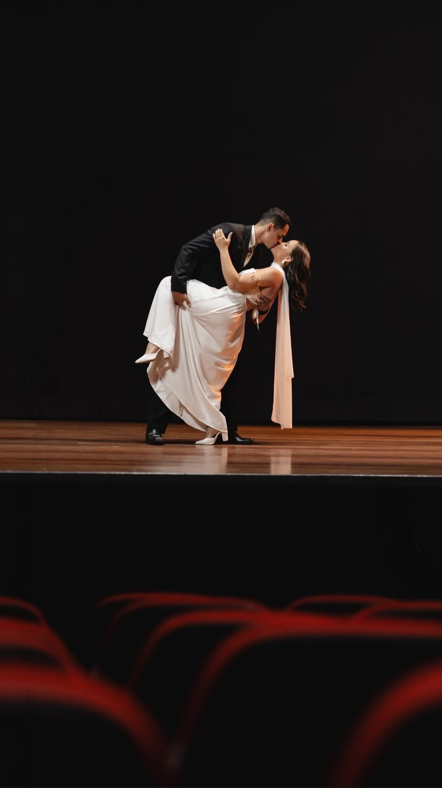

# Lavinia & Mateus Forever



Site de casamento desenvolvido para Lavinia e Mateus, reunindo convite digital, informacoes do evento, galeria de fotos, lista de presentes, contribuicao via PIX e mural de mensagens para os convidados.

## Objetivo

Criar uma experiencia digital elegante, responsiva e facil de compartilhar, permitindo que os convidados encontrem rapidamente os detalhes do casamento e participem da celebracao mesmo antes do grande dia.

## Preview

O projeto conta com uma interface visual focada em romantismo, fotos do casal, animacoes suaves e secoes organizadas para navegacao simples:

- Hero com imagem de capa e contagem regressiva.
- Historia do casal.
- Informacoes da cerimonia e dress code.
- Lista de presentes e contribuicao via PIX.
- Galeria de fotos com visualizacao ampliada.
- Mural de mensagens para os noivos.
- Musica de fundo e detalhes visuais animados.

## Deploy

Deploy online: em breve.

Repositorio: [github.com/EmersonBayonetta/lavinia-mateus-forever](https://github.com/EmersonBayonetta/lavinia-mateus-forever)

## Tecnologias

- React
- TypeScript
- Vite
- Tailwind CSS
- shadcn/ui
- Radix UI
- Framer Motion
- Lucide React
- Supabase REST API
- Vitest
- Playwright
- ESLint

## Stack

**Frontend:** React, TypeScript, Vite e Tailwind CSS.

**UI e interacoes:** shadcn/ui, Radix UI, Framer Motion e Lucide React.

**Dados:** Supabase para mensagens compartilhadas entre usuarios, com fallback em `localStorage` no ambiente local.

**Qualidade:** ESLint, Vitest e Playwright.

## Funcionalidades

- Layout responsivo para desktop e dispositivos moveis.
- Navegacao por secoes do convite.
- Contagem regressiva para 25 de julho de 2026 as 16h.
- Link para abrir o endereco da cerimonia no Google Maps.
- Cards de presentes com direcionamento para lista externa.
- Area de contribuicao via PIX com QR Code e copia do codigo PIX.
- Galeria de fotos com modal de ampliacao.
- Formulario para envio de mensagens aos noivos.
- Persistencia de mensagens via Supabase quando as variaveis de ambiente estao configuradas.
- Fallback automatico para salvar mensagens no navegador durante o desenvolvimento local.

## Como rodar

Clone o repositorio e instale as dependencias:

```sh
git clone https://github.com/EmersonBayonetta/lavinia-mateus-forever.git
cd lavinia-mateus-forever
npm install
```

Crie o arquivo `.env` a partir do exemplo:

```sh
cp .env.example .env
```

Configure as variaveis caso queira usar o mural de mensagens com Supabase:

```env
VITE_SUPABASE_URL=
VITE_SUPABASE_ANON_KEY=
```

Para criar a tabela e as politicas no Supabase, use o script:

```txt
supabase-wedding-messages.sql
```

Inicie o servidor de desenvolvimento:

```sh
npm run dev
```

Gere a versao de producao:

```sh
npm run build
```

Visualize o build localmente:

```sh
npm run preview
```

## Scripts

```sh
npm run dev
npm run build
npm run preview
npm run lint
npm run test
npm run test:watch
```

## Aprendizados do projeto

- Organizacao de uma landing page real com multiplas secoes e foco em experiencia do usuario.
- Uso de animacoes com Framer Motion sem comprometer a leitura do conteudo.
- Integracao com Supabase via REST API usando variaveis de ambiente.
- Criacao de fallback local para manter o fluxo funcional durante o desenvolvimento.
- Composicao de interface responsiva com Tailwind CSS, shadcn/ui e componentes reutilizaveis.
